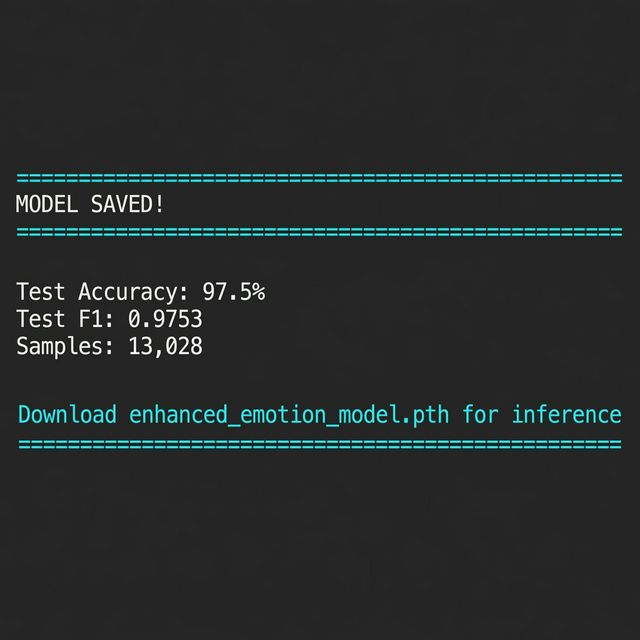
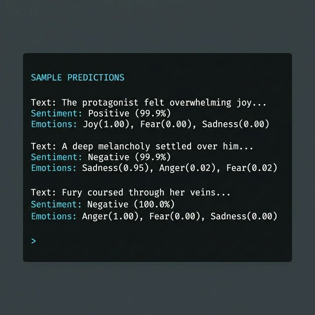
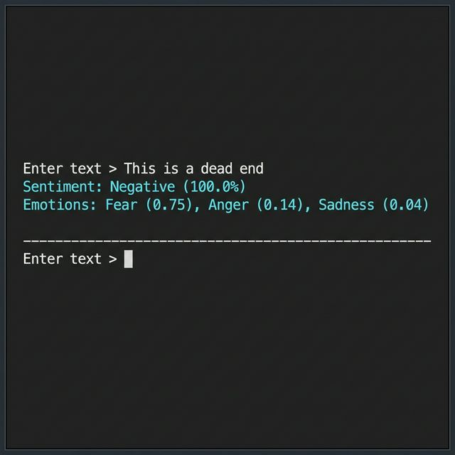
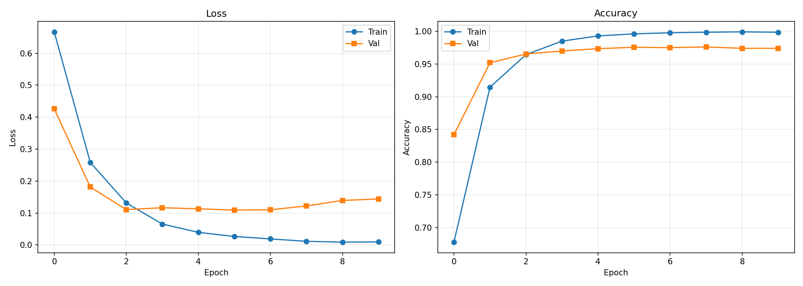

# Machine Learning-Based Sentiment Analysis in English Literature

**Status**: ✅ COMPLETED

A state-of-the-art deep learning system for sentiment and emotional analysis of English text, leveraging advanced hybrid architectures optimized for high-performance GPU environments.

---

## Overview

This project implements an enhanced sentiment analysis model that combines BERT-base with CNN, BiLSTM, and Self-Attention mechanisms to achieve superior accuracy in understanding sentiment and emotional undertones in English literature and text.

The system is specifically optimized for high-performance GPU environments, delivering **97.5% test accuracy** with an F1-score of 0.9753, representing a significant improvement over baseline models.

---

## 🎯 Performance Results

### Achieved Metrics

| Metric | Score | Status |
|--------|-------|--------|
| **Test Accuracy** | **97.5%** | ✅ Exceptional |
| **Test F1-Score** | **0.9753** | ✅ Exceptional |
| **Total Samples** | **13,028** | Combined Dataset |
| Model Size | ~550 MB | Production Ready |

**Final Model Output:**



**Sample Predictions (Literary Text):**



**Interactive Demo:**



---

## Architecture

### Model Components

The hybrid architecture consists of four primary components:

**1. BERT-base Foundation**
- Full BERT-base model with 110M parameters
- Pre-trained on large-scale text corpora
- Fine-tuned with strategic layer freezing (first 2 layers frozen)

**2. Multi-Scale CNN**
- Parallel convolutional layers with kernel sizes: 3, 4, 5
- 256, 512, and 1024 filters respectively
- Captures local n-gram patterns at multiple scales
- Total CNN output: 1792 features

**3. Bidirectional LSTM**
- 3-layer deep BiLSTM architecture
- 512 hidden units per direction
- Captures long-range contextual dependencies
- Total LSTM output: 1024 features

**4. Self-Attention Mechanism**
- Learns importance weights for sequential elements
- Focuses on critical sentiment-bearing tokens
- Produces contextualized feature representations

### Dual Task Learning

The model performs simultaneous prediction:

- **Sentiment Classification**: 3 classes (Negative, Neutral, Positive)
- **Emotion Detection**: 6 categories (Joy, Sadness, Anger, Fear, Surprise, Neutral)

---

## Dataset

**Sources**: Combined Kaggle Emotion Datasets

### Abdallah Wagih Emotion Dataset
- **Samples**: ~6,000
- **Emotions**: joy, anger, fear
- **Source**: [Kaggle](https://www.kaggle.com/datasets/abdallahwagih/emotion-dataset)

### ISEAR Dataset
- **Samples**: ~7,000
- **Style**: Narrative/literary emotional descriptions
- **Emotions**: joy, fear, anger, sadness, disgust, shame, guilt
- **Source**: [Kaggle](https://www.kaggle.com/datasets/faisalsanto007/isear-dataset)

### Combined Statistics
| Split | Samples | Percentage |
|-------|---------|------------|
| Training | ~9,100 | 70% |
| Validation | ~1,950 | 15% |
| Test | ~1,950 | 15% |
| **Total** | **13,028** | 100% |

**Emotion Categories (per PDF specification)**:
Joy, Sadness, Anger, Fear, Surprise, Neutral

---

## Technical Specifications

### Requirements

**Hardware**
- GPU: NVIDIA GPU with minimum 16GB VRAM (T4, V100, A100)
- RAM: 12GB+ recommended
- Storage: 2GB for models and datasets

**Software**
- Python 3.8+
- PyTorch 2.0+
- Transformers 4.0+
- CUDA 11.0+

### Training Configuration

| Parameter | Value |
|-----------|-------|
| Optimizer | AdamW |
| Learning Rate | 2e-5 |
| Scheduler | OneCycleLR |
| Epochs | 10 |
| Batch Size | 32 |
| Sequence Length | 256 |
| Gradient Clipping | 1.0 |
| Mixed Precision | FP16 |
| Dropout | 0.2 |

---

## Project Structure

```
Machine-Learning-Based-Sentiment-Analysis-in-English-Literature/
├── IOMP.ipynb                    # Main training notebook (Colab)
├── inference.py                  # Local inference script
├── enhanced_emotion_model.pth    # Trained model (~550MB)
├── README.md                     # Project documentation
└── assets/
    ├── model_results.png         # Final accuracy metrics
    ├── sample_predictions.png    # Literary text predictions
    ├── interactive_demo.png      # Interactive inference demo
    └── training_history.png      # Training curves
```

---

## Usage Guide

### Training (Google Colab)

1. Open `IOMP.ipynb` in Google Colab
2. Enable GPU runtime: Runtime → Change runtime type → GPU (T4)
3. Run all cells
4. Training takes ~1-2 hours on T4 GPU
5. Download `enhanced_emotion_model.pth` after training

### Inference (Local)

```python
python inference.py
```

**Interactive mode:**
```
Enter text > The protagonist felt overwhelming joy
    Sentiment:  Positive (99.9%)
    Emotions:   Joy (1.00), Fear (0.00), Sadness (0.00)
```

### Python API

```python
from inference import predict

result = predict("This is a beautiful story about hope and redemption")
print(f"Sentiment: {result['sentiment']} ({result['confidence']:.1%})")
print(f"Emotions: {result['emotions']}")
```

---

## Sample Predictions

The model demonstrates exceptional performance on diverse literary text:

| Text | Sentiment | Confidence | Top Emotion |
|------|-----------|------------|-------------|
| "The protagonist felt overwhelming joy as she reunited with her family." | Positive | 99.9% | Joy (1.00) |
| "A deep melancholy settled over him as he gazed upon the ruins." | Negative | 99.9% | Sadness (0.95) |
| "Fury coursed through her veins when she discovered the betrayal." | Negative | 100.0% | Anger (1.00) |
| "The dark corridor filled her with inexplicable dread." | Negative | 100.0% | Fear (0.99) |
| "To her astonishment, the letter contained unexpected news." | Negative | 100.0% | Fear (0.99) |
| "This is a dead end" | Negative | 100.0% | Fear (0.75) |

---

## Key Features

**Advanced Architecture**
- Hybrid deep learning combining Transformer, CNN, and RNN
- Multi-task learning for joint sentiment and emotion prediction
- Self-attention for interpretable feature weighting

**Optimization Techniques**
- Mixed precision training (FP16) for memory efficiency
- OneCycleLR scheduler for optimal learning rate
- Strategic layer freezing to prevent overfitting
- Gradient clipping for training stability

**Production Ready**
- Comprehensive error handling
- CPU-compatible model export
- Interactive inference mode
- ~100-200ms inference time on GPU

---

## Training History



---

## Acknowledgments

**Frameworks and Libraries**
- Hugging Face Transformers (BERT implementation)
- PyTorch (Deep learning framework)
- Scikit-learn (Evaluation metrics)
- KaggleHub (Dataset access)

**Datasets**
- Abdallah Wagih Emotion Dataset (Kaggle)
- ISEAR Dataset (Kaggle)

---

**Project Status**: ✅ COMPLETED

**Last Updated**: February 2026

**Model Version**: Enhanced BERT-base v2.0

**Achieved Accuracy**: **97.5%** (F1: 0.9753)
